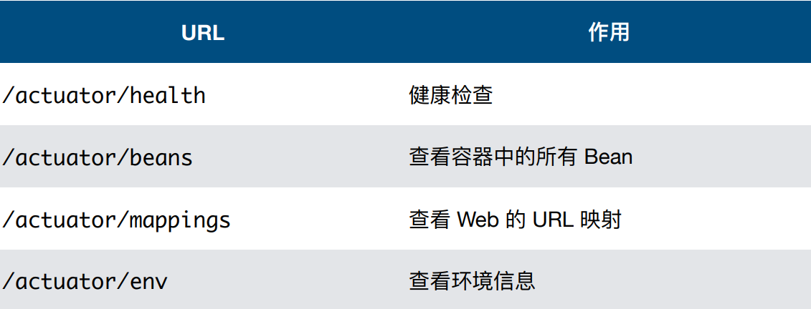
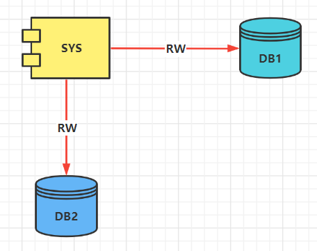
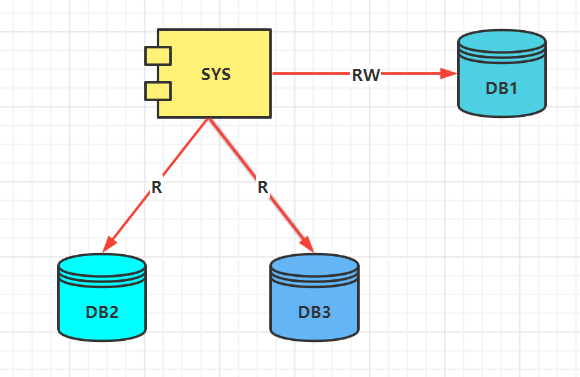
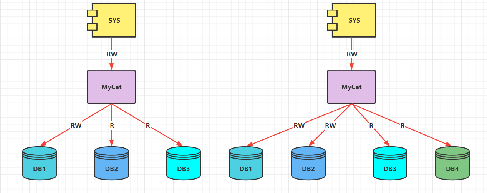

## 开发环境
* **Java8/Java11(Lambda表达式必须8及以上版本)**
* **IntelliJ IDEA 2022.1.1 (Ultimate Edition)**
* **Apache Maven**
* **Windows11 OS**
* **Docker**

***

## Spring常用注解
### Java Config相关注解
* **@Configuration**
  * 
* **@ImportResource**
  * 
* **@ComponentScan**
  * 
* **@Bean**
  * 
* **@ConfigurationProperties**
  * 

### 定义相关注解
* **@Component**
  * 
* **@Repository**
  * 
* **@Service**
  * 
* **@Controller**
  * 
* **@RestController**
  * 
* **@RequestMapping**
  * 

### 注入相关注解
* **@Autowired**
  * 
* **@Qualifier**
  * 
* **@Resource**
  * 
* **@Value**
  * 

***

## Actuator Endpoints
### EndPoint

### 解禁Endpoint
**默认**
* /actuator/health
* /actuator/beans

**解禁所有Endpoints**

**在application.properties或者application.yml中配置**
* management.endpoints.web.exposure.include=*

***

## 多数据源、分库分表、读写分离
### 系统需要访问几个完全不同的数据库

### 系统需要访问同一个库的主库和备库

### 系统需要访问一组做了分库分表的数据库

### 分库分表中间件
#### Cobar
* **Cobar**

#### TDDL
* **TDDL**

#### MyCAT
* **MyCAT**

#### Sharding-Shpere
* **Sharding-Shpere**

## 参考链接
[https://blog.csdn.net/open1024/article/details/122808678](https://blog.csdn.net/open1024/article/details/122808678)
[https://www.pudn.com/news/6288b540b305d84a4fb39bca.html](https://www.pudn.com/news/6288b540b305d84a4fb39bca.html)