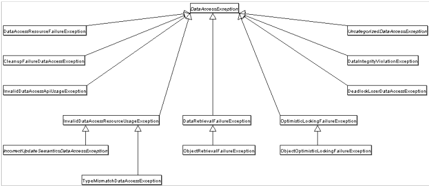

## Spring的JDBC异常抽象

* **Spring会将数据库操作的异常转换为DataAccessException**
* **无论使用何种数据访问方式，都能使用一样的异常**

***

## Spring如何识别错误码

**通过SQLErrorCodeSQLExceptionTranslator**解析错误码
**ErrorCode定义**
* org/springframework/jdbc/support/sql-error-codes.xml
* Classpath下的sql-error-codes.xml

***

## 自定义错误码解析逻辑
    <bean id="H2" class="org.springframework.jdbc.support.SQLErrorCodes">
        <property name="badSqlGrammarCodes">
            <value>42000,42001,42101,42102,42111,42112,42121,42122,42132</value>
        </property>
        <property name="duplicateKeyCodes">
            <value>23001,23505</value>
        </property>
        <property name="dataIntegrityViolationCodes">
            <value>22001,22003,22012,22018,22025,23000,23002,23003,23502,23503,23506,23507,23513</value>
        </property>
        <property name="dataAccessResourceFailureCodes">
            <value>90046,90100,90117,90121,90126</value>
        </property>
        <property name="cannotAcquireLockCodes">
            <value>50200</value>
        </property>
        <property name="customTranslations">
            <bean class="org.springframework.jdbc.support.CustomSQLErrorCodesTranslation">
                <property name="errorCodes" value="23001,23505" />
                <property name="exceptionClass"
                          value="com.sakura.errorcode.exception.CustomDuplicatedKeyException" />
            </bean>
        </property>
    </bean>

***

## 参考链接
[https://juejin.im/post/5ce8e9f251882530e4653404](https://juejin.im/post/5ce8e9f251882530e4653404)