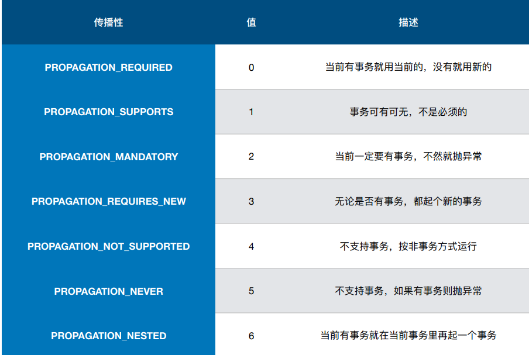
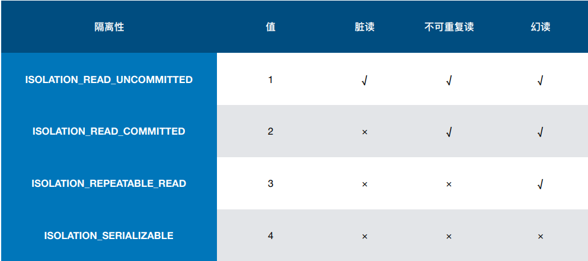
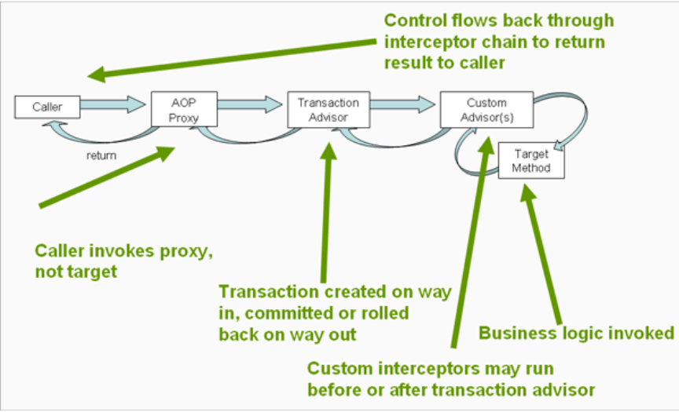

## Spring事务抽象

**一致性的事务模型**
* **JDBC/Hibernate/myBatis**
* **DataSource/JPA**

***

## 事务抽象核心接口
**PlatformTransactionManager**
* DataSourceTransactionManager
* HibernateTransactionManager
* JPATransactionManager

`void commit(TransactionStatus status) throws TransactionException;`

`void rollback(TransactionStatus status) throws TransactionException;`

`TransactionStatus getTransaction(@Nullable TransactionDefinition definition) throws TransactionException;`

**TransactionDefinition**
* Propagation
* Isolation
* Timeout
* Read-only status

***

## 事务传播特性

***

## 事务隔离特性

**TransactionDefinition**

    int ISOLATION_DEFAULT = -1;
    int ISOLATION_READ_UNCOMMITTED = 1;
    int ISOLATION_READ_COMMITTED = 2;
    int ISOLATION_REPEATABLE_READ = 4;
    int ISOLATION_SERIALIZABLE = 8;

***

## 编程式事务
**TransactionTemplate**
* TransactionCallback
* TransactionCallbackWithoutResult

**PlatformTransactionManager**
* 可以传入TransactionDefinition进行定义

***

## 声明式事务

## 基于注解的配置方式
**开启事务注解的方式**
* @EnableTransactionManagement
* <<tx:annotation-driven/>>

**一些配置**
* proxyTargetClass
* mode
* order

**@Transaction**
* transactionManager
* propagation
* isolation
* timeout
* readOnly
* 怎么判断回滚

***

## 参考链接
* [https://www.cnblogs.com/yanchuanbin/p/14731530.html](https://www.cnblogs.com/yanchuanbin/p/14731530.html)