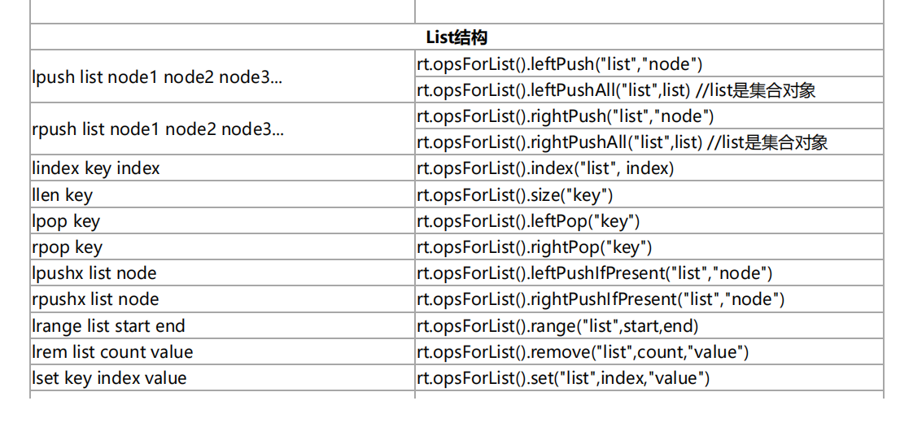

## 与Redis建立连接
### 配置连接工厂
* **LettuceConnectionFactory 与 JedisConnectionFactory**   
  * **RedisStandaloneConfiguration**   
  * **RedisSentinelConfiguration**   
  * **RedisClusterConfiguration**

***

## 读写分离
### Lettuce 内置支持读写分离
* **只读主、只读从**   
* **优先读主、优先读从**

### LettuceClientConfiguration
### LettucePoolingClientConfiguration
### LettuceClientConfigurationBuilderCustomizer

***

## RedisTemplate
### RedisTemplate<K, V>
* opsForXxx()

### StringRedisTemplate

### **注：一定要设置过期时间**

### RedisTemplate操作方法

***

## Redis Repository
#### 实体注解
* **@RedisHash**   
* **@Id**   
* **@Indexed**

***

## 处理不同类型数据源的 Repository
### 如何区分 Repository
* **根据实体的注解**   
* **根据继承的接口类型**   
* **扫描不同的包**
